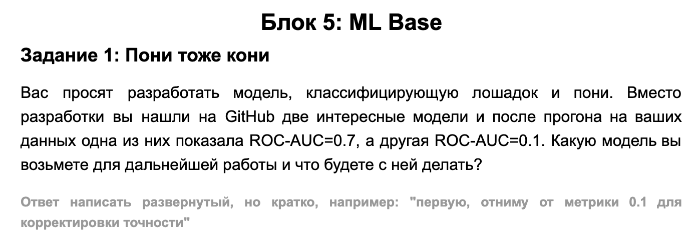
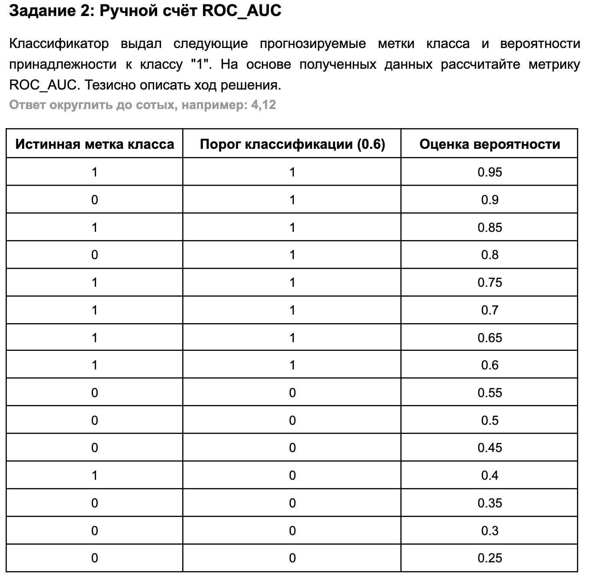
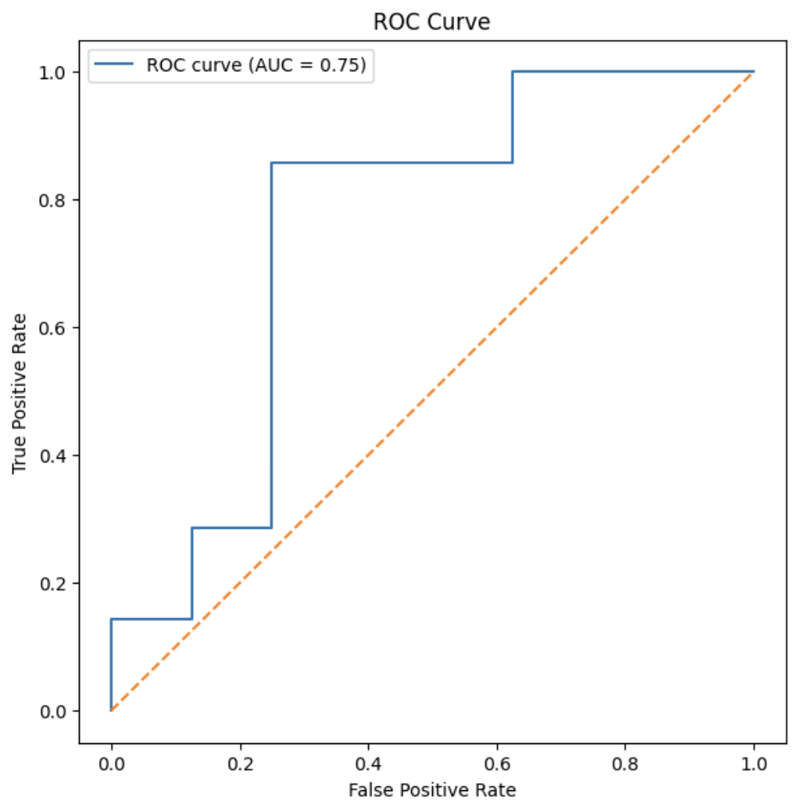
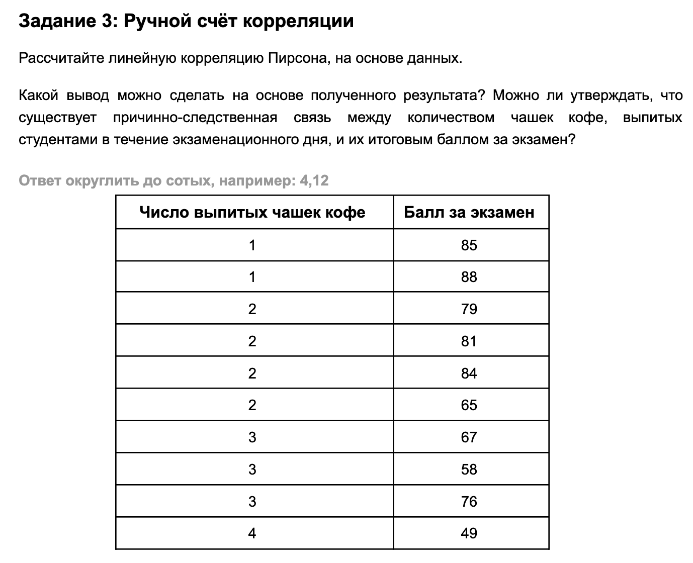

## Задание 1



### Ответ

> Вторую, так как ROC-AUC симметрична, соответственно мы можем просто поменять метки классов и тогда у нас получится 0.9 - наилучшая метрика из представленных двух

---

## Задание 2



### Ответ

> ROC_AUC = 0.75

Результат можно узнать через вероятностный способ

Делим по истинной метке класса на два списка и попарно сравниваем их между собой по значению вероятности каждого объекта

```text
(if score 1 > score 0; 1; 0)
```

далее делим получившийся результат на количество сравнений т.е. пар и в итоге получаем 

> ROC_AUC = 42/56 = 0.75

Проверив через площадь под кривой результаты совпали

<p align="center">
  
</p>

---

## Задание 3



### Ответ

```text
r ≈ -0.73
```

Довольно сильна отрицательная кореляция, сдуденты которые выпили больше кофе в среднем сдали экзамен хуже своих менее пьющих одногруппников

но корреляция не означает причинно следственную связь
