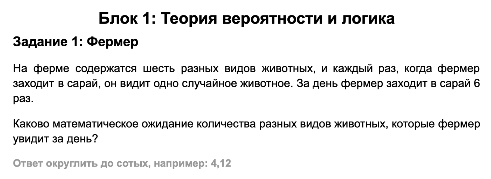
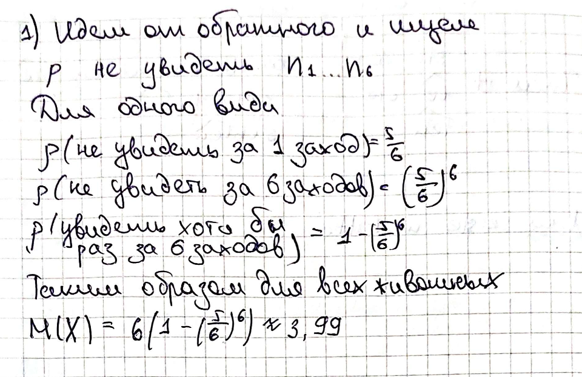
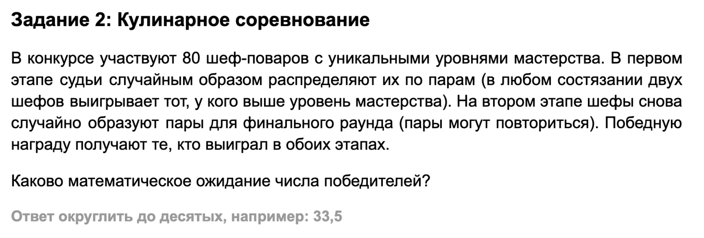
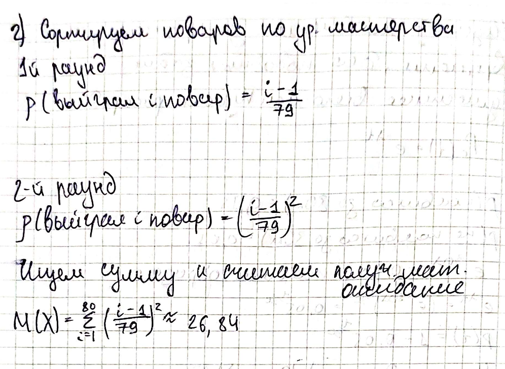
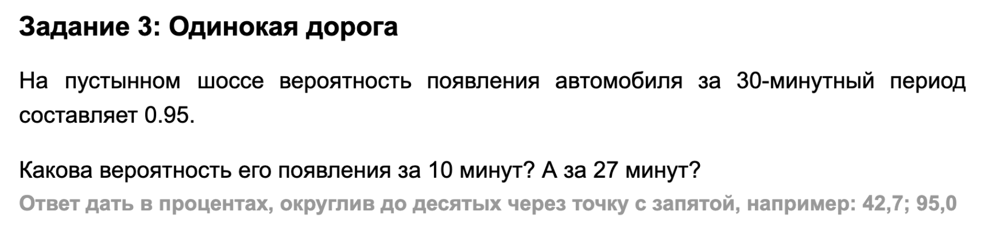
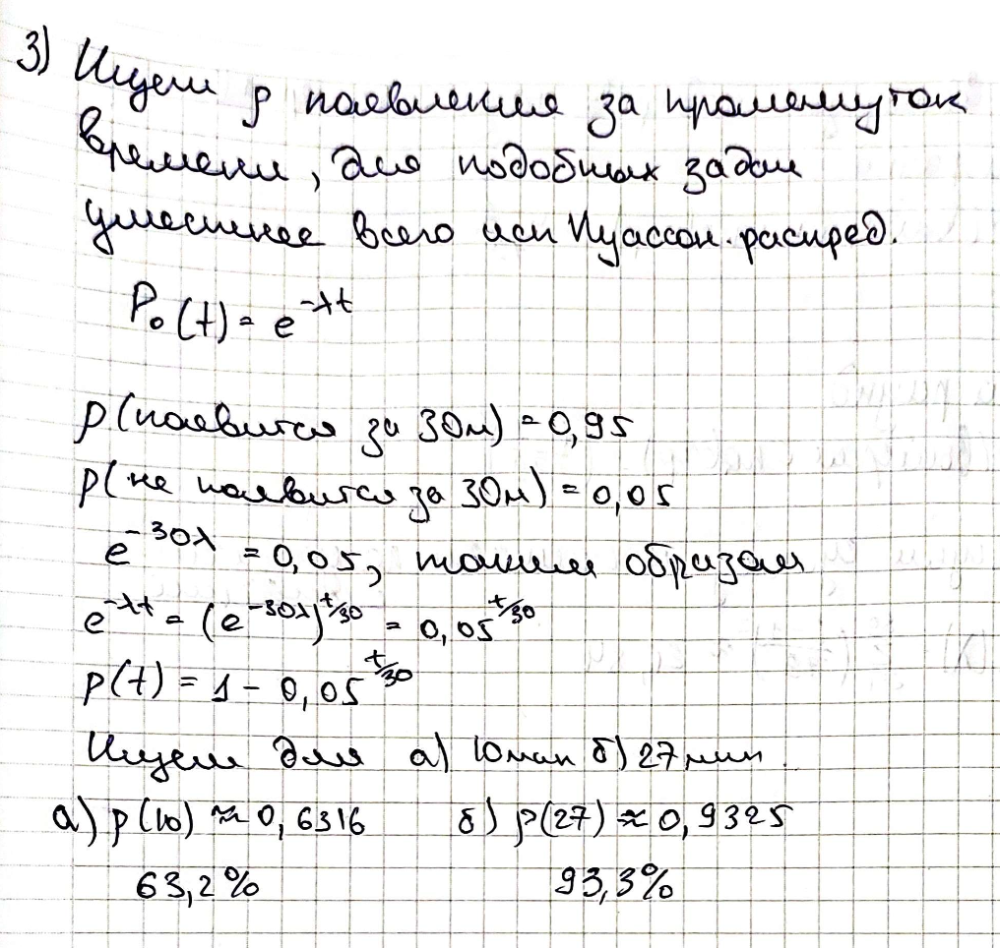

# Теория вероятности и логика

## Задание 1

### Ответ

> **3.99**

<b>Решение</b>

 

---

## Задание 2

### Ответ

> **26.84**

<b>Решение</b>

 

---

## Задание 3

### Ответ

> **63.2%; 93.3%**

<b>Решение</b>

 

