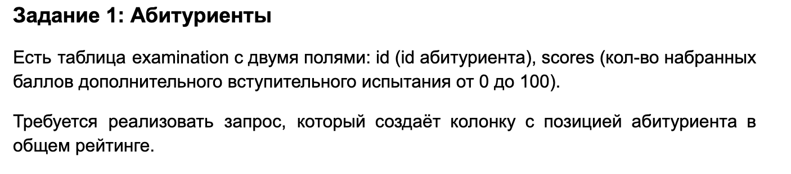
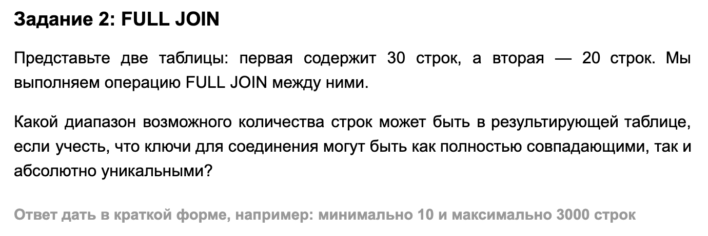
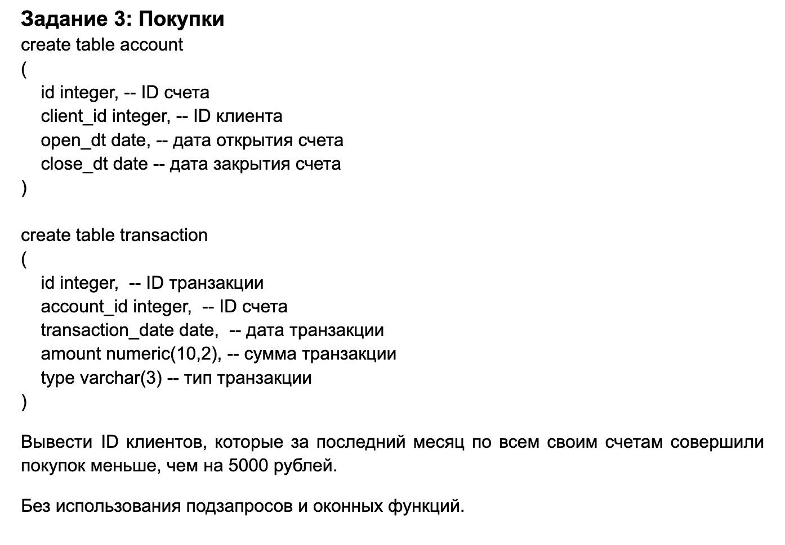

# SQL

## Задание 1



### Ответ

```sql
SELECT
    id,
    scores,
    RANK() OVER (ORDER BY scores DESC) AS rating_position
FROM examination;
```

---

## Задание 2



### Ответ

> Минимум — **30 строк**, максимум — **600 строк**.

---

## Задание 3



### Ответ

```sql
SELECT
    a.client_id
FROM account a
LEFT JOIN transaction t
    ON a.id = t.account_id
    AND t.transaction_date >= CURRENT_DATE - INTERVAL '1 month'
    AND t.type = 'buy'
GROUP BY a.client_id
HAVING COALESCE(SUM(t.amount), 0) < 5000;
```
